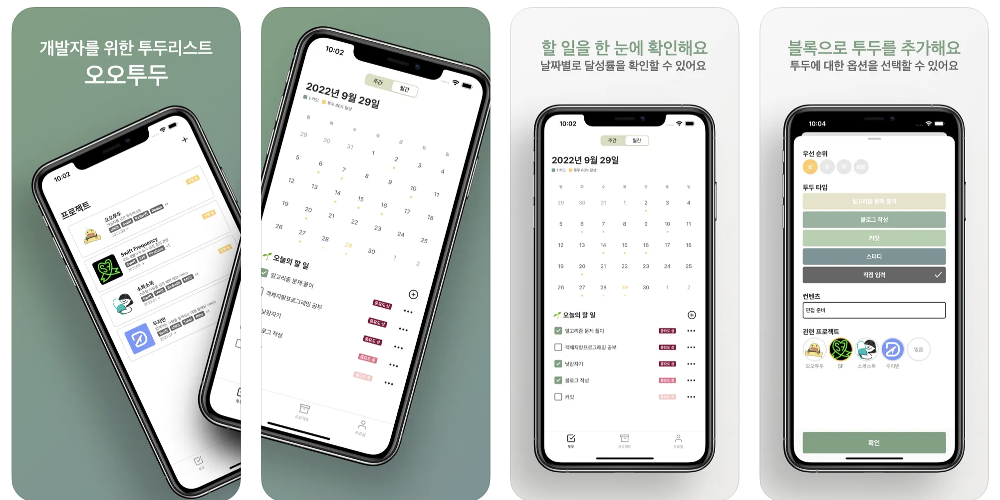

# 오오투두
> 📝 · 개발자를 위한 투두 리스트, 오오투두  
> 📅 · 2022.09.07 ~ 2022.10.07



## Summary
#### ▪️ 투두 작성
- 투두의 우선순위를 상, 중, 하로 설정
- 개발자(개발 취준생)이 자주 수행하는 항목에 대한 기본 투두 블록 제공
- 투두 항목에 대한 연관 프로젝트 설정
#### ▪️ 투두 리스트 달성률 확인
#### ▪️ 개발 프로젝트 아카이빙 및 목록 확인
#### ▪️ 깃허브 커밋 기록 확인

<br />

## Main works
- Realm Database를 이용한 데이터 저장 및 관리
- ReactorKit, RxSwift를 이용한 반응형 프로그래밍
- Fastlane을 이용한 TestFilght 업로드 자동화
- Danger을 이용한 CI 프로세스 중 코드 검토 자동화
- 모듈 단위로 Framework 분리

<br />

## Tech spec
- 구조 : UIKit, Code-based, MVC + MVVM(ReactorKit 부분 적용)
- 네트워킹 : Alamofire
- 데이터베이스 : Realm
- 비동기 처리 : RxSwift, RxCocoa
- User Interface : SnapKit, FSCalendar
- 자동화 : Fastlane, Danger
- 기획 및 디자인 : Notion, Figma

<br />

## Problem solving || Trouble shooting

### 1. CollectionView Adapter를 구현하여 객체의 역할 분리

#### ▪️ 목적
- ViewController에서 CollectionView의 Delegate, Data Source 코드를 분리하고 싶다.
- 최대한 각각의 역할을 분리해서 코드 유지/보수를 용이하게 하고 싶다.

#### ▪️ 코드 일부
- CollectionView의 설정을 담당하는 Adapter라는 클래스를 만들어서 역할을 분리합니다.
- 기존에는 Controller에서 DataSource, Delegate의 설정을 모두 담당했는데 그 역할을 Adapter로 넘겨주면서 역할을 분리합니다.

```swift
// 데이터 관리
protocol TodoListCollectionViewAdapterDataSource: AnyObject {
    var numberOfSections: Int { get }
    var numberOfItems: Int { get }
    
    func todo(at index: Int) -> Todo
}
```
```swift
// 이벤트 관리
protocol TodoListCollectionViewAdapterDelegate: AnyObject {
    func todoHeaderViewCreateButtonDidTap()
    func todoTapped(_ todo: Todo, at index: Int)
    func todoCheckBoxTapped(_ todo: Todo, at index: Int)
}
```
```swift
// CollectionView에 데이터와 이벤트 바인딩
final class TodoListCollectionViewAdapter: NSObject {

    weak var adapterDataSource: TodoListCollectionViewAdapterDataSource?
    weak var delegate: TodoListCollectionViewAdapterDelegate?
    
    init(
        collectionView: UICollectionView,
        adapterDataSource: TodoListCollectionViewAdapterDataSource?,
        delegate: TodoListCollectionViewAdapterDelegate?
    ) {
        super.init()

        self.adapterDataSource = adapterDataSource
        self.delegate = delegate
        
        collectionView.collectionViewLayout = generateLayout()
        collectionView.delegate = self
        collectionView.dataSource = self

        collectionView.register(
            SectionHeaderView.self,
            ofKind: UICollectionView.elementKindSectionHeader
        )
        collectionView.register(TodoListCell.self)
    }
}
```
```swift
// ViewController.swift
// Controller에서는 CollectionView를 Adapater에 전달하기만 하면 됨

private lazy var adapter = TodoListCollectionViewAdapter(
    collectionView: collectionView,
    adapterDataSource: viewModel,
    delegate: self
)
```

#### ▪️ 피드백
> 역할을 분리하는 것에 대한 장점을 확인할 수 있었습니다.

`장점`
- 복잡한 화면 구성 또는 규모가 있는 프로젝트에서는 유용할 수 있겠다라는 생각이 들었습니다.
- 컬렉션 뷰에 관련된 코드의 수정이 필요한 경우 Adapter 클래스를 중심으로 확인을 하면 되기 때문에 코드의 수정 및 보완이 용이했습니다.
- Adapater를 좀 더 제네릭하게 구현한다면 여러 화면에서 유용하게 쓰일 수 있을 것 같습니다.

`단점`
- 작은 기능과 화면에서는 오버 엔지니어링이 될 수 있습니다.
- 파일과 코드 라인 수가 오히려 증가하는 것을 느꼈습니다. (적절한 판단이 필요할 것 같습니다.)
- 위와 같은 경우는 오히려 MVC로 구현하는 것이 더 나을 수 있겠다라는 생각이 들었습니다.

### 2. CollectionView의 높이(Height)를 Contents의 크기에 맞추어 동적으로 조절하기

#### ▪️ 문제 상황
||
|:--:|
||

빨간색 영역을 CollectionView로 구현하고 있는 상황입니다. 투두 항목이 추가 될 때마다 CollectionView 내부의 Contents의 높이는 증가하게 됩니다. 처음부터 CollectionView의 높이를 하드코딩해서 고정시켜버리면 단순히 스크 롤되는 형태로 원하는 동작을 얻어낼 수가 없었습니다. CollectionView 영역의 높이가 Contents의 높이에 따라서 조절되기를 원했습니다.

#### ▪️ 문제 접근
방법을 여러가지 찾아보기 시작했습니다. 만약 셀 높이가 고정적이라면 (개수 x 셀 높이)를 계산해서 CollectionView의 높이를 바꿔줄 수 있을텐데, 셀마다 높이가 다를 수도 있으니까 적절한 답이 될 수 없었습니다.
CollectionView의 데이터의 변경이 일어날 때마다 레이아웃 갱신도 일어나야 하는데 이 시점에서 intrinsicContentSize(고유 컨텐츠 크기) 값을 다시 계산해주어서 해결할 수 있었습니다.

#### ▪️ 코드 일부
- intrinsicContentSize 프로퍼티
- invalidateIntrinsicContentSize 메소드(view의 컨텐츠 크기가 변화하였을때 intrinsicContentSize 프로퍼티를 통해서 크기를 갱신하고 그에 맞춰서 AutoLayout이 업데이트 되도록 만들어주는 메서드)
- 위 두 가지를 이용해서 view의 contentSize가 변화할 때 해당 메서드를 호출하면 intrinsicContentSize 값을 새로 계산하도록 하는 방식으로 해결했습니다.

```swift
open class BaseCollectionView: UICollectionView {
    
    open override var contentSize: CGSize {
        didSet {
            if oldValue.height != contentSize.height {
                invalidateIntrinsicContentSize()
            }
        }
    }
    
    open override var intrinsicContentSize: CGSize {
        layoutIfNeeded()
        return CGSize(width: UIView.noIntrinsicMetric, height: contentSize.height + 44)
    }
}
```

<br />

## Feedback
> 더 자세한 이야기를 확인하고 싶다면 아래 링크를 참고해주세요.

### 블로그
- [[오오투두 1편] 기획, 참 어렵다...](https://taekki-dev.tistory.com/119)
- [[오오투두 2편] 디자인... 디자인 시스템... 그리고 모듈화.](https://taekki-dev.tistory.com/120)
- [[오오투두 3편] 프로젝트 진행 그리고 개발..](https://taekki-dev.tistory.com/121)
- [[오오투두 4편] 프로젝트 회고 및 출시 후기](https://taekki-dev.tistory.com/122)

### 점검
- [오오투투_중간](https://github.com/TeamOOTD/OOTD-iOS/blob/develop/Assets/%EC%98%A4%EC%98%A4%ED%88%AC%EB%91%90_%EC%A4%91%EA%B0%84.pdf)
- [오오투투_최종](https://github.com/TeamOOTD/OOTD-iOS/blob/develop/Assets/%EC%98%A4%EC%98%A4%ED%88%AC%EB%91%90_%EC%B5%9C%EC%A2%85.pdf)
